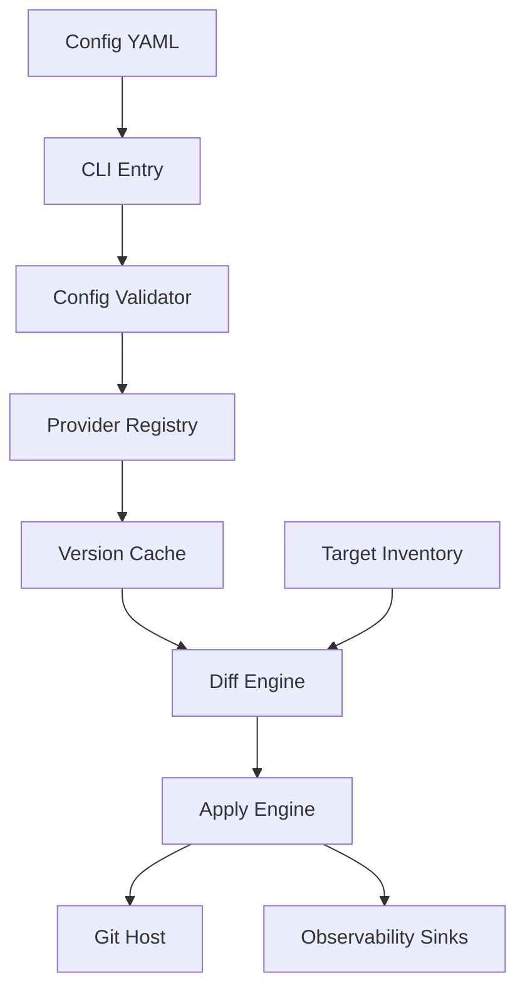

# Updater CLI Design Specification

## 1. Objectives and Scope
- Deliver a declarative CLI that ingests GitOps configuration, discovers upstream package versions, evaluates rollout impact, and raises pull requests to keep environments up to date.
- Target package ecosystems include Helm charts, Docker images, Terraform modules, and generic git releases, with extensibility for future sources.
- Success metrics: deterministic runs, auditable change manifests, compatibility with CI workflows, and straightforward extension for agent-driven automation.
- Out of scope: manual application of updates without Git workflows, direct credentials management beyond supported secret providers, and UI dashboards.

## 2. Guiding Principles
- Configuration-as-code: all behaviour derives from a YAML document under version control.
- Idempotent automation: repeated runs yield consistent results while respecting provider rate limits and staging policies.
- Security first: secrets stay encrypted at rest, redacted in logs, and never persisted beyond runtime.
- Observability-friendly: structured logs, metrics, and trace hooks support troubleshooting and agent oversight.
- Extensible via plugins and documented interfaces for future package sources and target types.

## 3. System Context
The CLI entry point [main()](cmd/updater/main.go:1) registers subcommands and initializes logging via shared bootstrap logic. Configuration is parsed into [configuration.Config](internal/configuration/types.go:3), provider clients implement [ProviderClient](internal/scraper/provider.go:9), and concrete Git-backed scrapers such as [GitHubProviderClient](internal/scraper/provider-github.go:17) perform discovery.

## 4. Configuration Model and Secrets Handling
- Default config file path: `.updaterconfig.yml`, overridable via `--config` flag or `UPDATER_CONFIG` environment variable.
- Configuration can be provided as either:
  - A single YAML file (e.g., `.updaterconfig.yml`)
  - A directory containing multiple `.yml` or `.yaml` files (e.g., `.updater/` directory). All YAML files in the directory will be loaded and merged automatically. This enables modular configuration where providers, sources, and targets can be organized in separate files.
- When loading from a directory:
  - All `.yml` and `.yaml` files are loaded and merged
  - Duplicate names across files (providers, sources, or targets) will result in a validation error
  - The `targetActor` configuration, if present in multiple files, will use the last occurrence
- Supported sections:
  - `packageSourceProviders`: defines provider credentials, auth types, base URLs, and optional metadata.
  - `packageSources`: names, provider references, URIs, source type, optional `versionConstraint`, and cached version metadata.
  - `targets`: describes GitOps instances (repo, path, manifest type, stage, policy overrides) and optional validation hooks.
  - `stages`: ordered rollout stages with gating policies and approvals.

### 4.1 Secrets Injection Hierarchy
1. Inline plaintext values for non-sensitive fields.
2. Bash-style environment interpolation using `${ENV_VAR}` tokens resolved at runtime; missing variables trigger validation errors or explicit defaults.
3. SOPS-encrypted blocks for provider credentials and sensitive configuration:
   - Configuration supports embedding SOPS metadata and ciphertext; CLI detects SOPS sections, decrypts at runtime using available keys (KMS, PGP, age) via external `sops` binary or library bindings.
   - Decrypted values remain in memory only, never written to disk or logs.
   - Audit logging records which secret keys were accessed without exposing values.
   - Failure handling distinguishes missing keys from decryption errors, surfacing actionable diagnostics.

### 4.2 Schema Validation
- Ensure provider names referenced by sources exist and use compatible types.
- Enforce enum values for `type` fields, auth strategies, and stage policies.
- Validate SOPS metadata presence when encrypted fields are included.
- Support schema versioning with optional migrations and deprecation warnings.

## 5. CLI Command Architecture
All commands share bootstrap steps: resolve config path, parse YAML into [configuration.Config](internal/configuration/types.go:3), perform schema validation, hydrate providers, and initialize caches. Logging verbosity is controlled by `--verbose` and `--very-verbose` flags exported from [main()](cmd/updater/main.go:1).

### 5.1 validate
- Inputs: `--config`, `--output {table,json,yaml,sarif}`, optional `--probe-providers`.
- Outputs: success summary or structured error list with YAML pointer references.
- Exit codes: 0 on success, 3 on parse/validation failure.
- Optional provider warmup ensures credentials and rate limits are healthy.

### 5.2 load
- Discovers latest versions for each package source using provider clients, honoring `--limit`, `--refresh-cache`, and semver constraints.
- Presents tabular or JSON output including version string, published timestamp, and metadata such as digest or release notes.
- Populates in-memory and persisted caches to support follow-up commands without redundant API calls.

### 5.3 compare
- Combines cached discovery results with target inventory to compute update recommendations.
- Classifies each recommendation by upgrade type (major, minor, patch), policy compliance, and risk signals.
- Supports `--stage`, `--only major|minor|patch`, and `--format table|json`.
- Exit code 1 when pending updates exist, enabling CI gating.

### 5.4 apply
- Requires explicit confirmation via `--yes` or interactive prompt; supports `--dry-run` and `--resume <run-id>`.
- Stage-aware rollout processes stages sequentially according to configuration, respecting freeze windows and custom gates.
- Policy flags: `--stage`, `--allow-major`, `--allow-pre-release`, `--group-by {application,stage,source}`, `--split-prs`, `--max-pr-size`.
- Existing PR reconciliation:
  - Before mutating repositories, the CLI queries GitHub or GitLab for open PRs whose branch naming convention matches target recommendations.
  - If a PR exists and the latest desired version is pending, the CLI refreshes the branch (rebases or force-pushes new commits), updates the PR body, and preserves reviewers, labels, and discussion threads.
  - Closed-but-unmerged PRs are reopened or superseded based on configurable policies.
- Execution pipeline per batch:
  1. Clone repository into ephemeral workspace and checkout baseline branch.
  2. Invoke domain-specific mutators (Helm, Kustomize, Terraform, Docker) to update manifests.
  3. Run configured validation hooks (lint, tests, policy checks).
  4. Commit with standardized message, push branch, and create or update PR with changelog summaries and checklist.
  5. Record audit manifest capturing updates, PR URLs, commit SHAs, and validation results under `.updater/runs/<timestamp>.json`.
- Failure handling distinguishes transient git/network issues from validation failures and supports resumable reruns.

## 6. Provider Abstraction and Version Discovery
- Provider registry maps `(provider type, source type)` pairs to constructors.
- Extended interface methods: `NewClient(config)`, `Warmup(ctx)`, `Supports(sourceType)`, `ScrapePackageSource(source, opts)`, `FetchMetadata`.
- Discovery pipeline uses worker pools with rate-limit aware backoff, caches results keyed by provider and source hash, and returns normalized [PackageSourceVersion](internal/configuration/types.go:25) objects including metadata fields.
- Error handling categorizes transient vs permanent failures, surfacing actionable diagnostics with provider names.
- Provider templates document required behaviours for agents adding new integrations.

## 7. Version Comparison and Diff Engine
- Construct version graphs per source to model upgrade paths and constraints.
- Normalize semver triples; fallback heuristics handle Docker tag patterns (e.g., date-based tags).
- Instances produce `InstanceState` records capturing current version, stage, repository path, and policy overrides.
- Diff engine output: `UpdateRecommendation` objects with upgrade classification, changelog references, and required manual actions.
- Recommendations feed both `compare` reporting and `apply` batching logic.

## 8. Apply Execution Details
- Stage configuration defines ordering, gate conditions, and rollback policies.
- Workspace lifecycle supports sandboxed git operations, deterministic branch naming (`update/<stage>/<source>/<timestamp>`), and automatic cleanup.
- Hook system supports `preApply` and `postApply` commands with timeout and retry policies.
- Conflict management detects upstream changes, rebases branches, and surfaces manual intervention requirements.
- Resume mode replays audit manifests to continue incomplete batches.

## 9. Observability, Security, and Non-Functional Requirements
- Logging: zerolog-based structured logs with correlation IDs, respect `--verbose` flags, redacting secrets and SOPS-derived values.
- Metrics: optional Prometheus endpoint in daemon mode, CLI summary including provider latency, success counts, PR counts.
- Tracing: optional OTLP exporters for provider calls and git operations.
- Security: enforce least-privilege tokens, support secret managers through SOPS key sources, mask credentials in crash dumps, and sign git commits when configured.
- Performance: support hundreds of sources and thousands of targets per run via concurrency controls and caching.
- Reliability: retries with exponential backoff, circuit breakers per provider, deterministic ordering, resumable runs.
- Compliance: audit manifests, changelog references, and configurable reviewer assignments to satisfy governance requirements.

## 10. Implementation Roadmap
1. MVP: config parsing, validation, GitHub Helm discovery, and `validate`/ `load` commands.
2. Introduce diff engine, target inventory model, and `compare`.
3. Build `apply` pipeline with GitHub PR creation and audit manifests.
4. Expand provider support (Docker registry, Terraform modules), add staging policies and PR grouping.
5. Deliver observability enhancements, SOPS integration hardening, resumability, and GitLab parity.
6. Harden reconciliation logic for existing PR updates and multi-repo orchestrations.

## 11. Agentic Extension Guidelines
- Publish configuration JSON schema and protobuf definitions for recommendations to aid automated agents.
- Expose plugin registration hooks for providers, targets, and diff strategies with clear contracts and test templates.
- Document tasks for agents: adding provider client, creating mutator, extending policy module, or enhancing observability.
- Maintain backwards-compatible interfaces with semantic versioning and changelog entries.

## 12. Open Questions
- Should target inventory be derived solely from configuration or discovered dynamically by scanning repositories?
- Preferred secret manager integration priorities (Vault, AWS Secrets Manager, others) for SOPS key retrieval?
- Default PR grouping policy for production stages: single PR per stage or per application?
- Should `apply` enforce post-merge status checks or integrate with auto-merge workflows by default?
- Requirements for multi-tenant operation (multiple configs per process) and isolation guarantees?

---
Specification ready for feedback and implementation handoff.